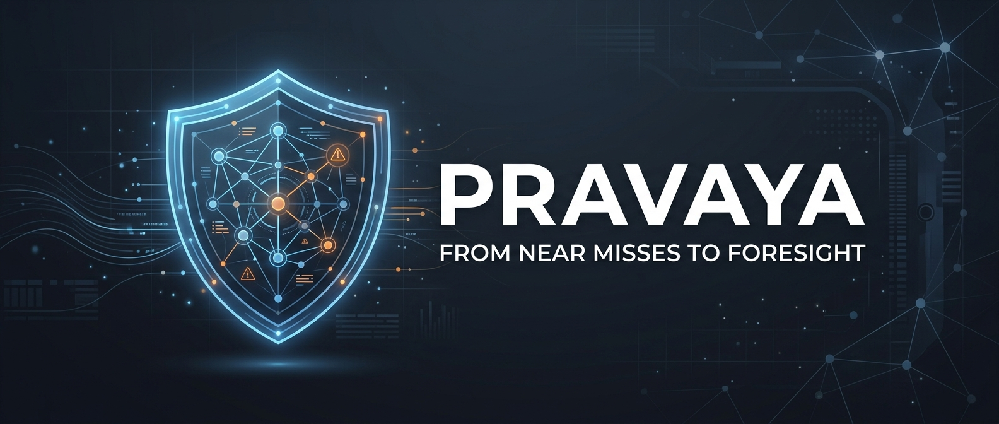
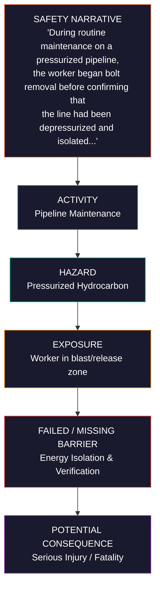
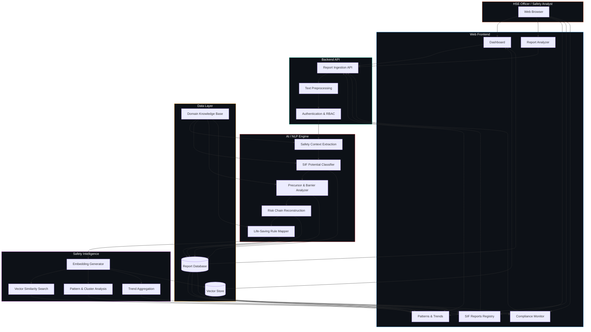
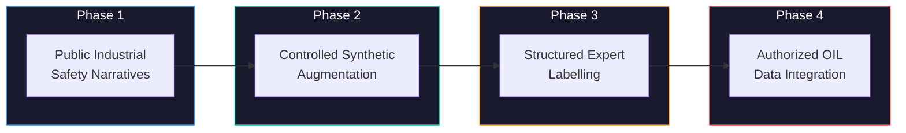
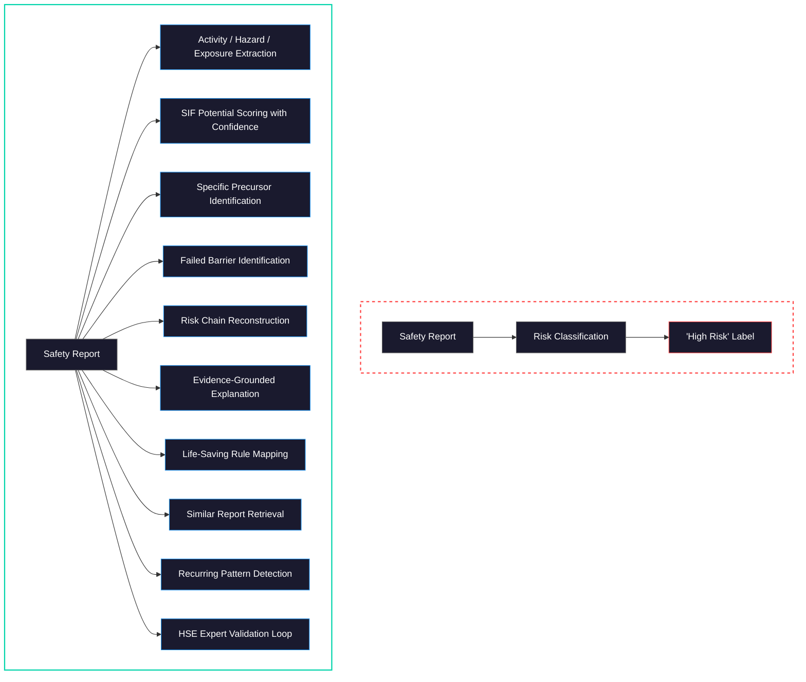

<br><div align="center">



<br>

### *From Near Misses to Foresight.*

<br>

**AI-Powered SIF Precursor Detection & Safety Intelligence System**

*Transforming unstructured safety narratives into actionable risk intelligence for Oil & Gas operations*

<br>

[](https://www.sih.gov.in/)
[](https://www.sih.gov.in/)
[](https://www.oil-india.com/)
[]()
[]()

</div>

<br>

---

<br>

## Table of Contents

- [Overview](#overview)
- [Problem Statement](#problem-statement)
- [Our Approach](#our-approach)
- [What is a SIF Precursor?](#what-is-a-sif-precursor)
- [Key Features](#key-features)
- [System Architecture](#system-architecture)
- [Proposed Tech Stack](#proposed-tech-stack)
- [Project Structure](#project-structure)
- [Getting Started](#getting-started)
- [Dataset Strategy](#dataset-strategy)
- [Core Differentiation](#core-differentiation)
- [Screenshots](#screenshots)
- [Roadmap](#roadmap)
- [Data & Limitations Disclaimer](#data--limitations-disclaimer)
- [Team Neural Forge](#team-neural-forge)
- [License](#license)

<br>

---

<br>

## Overview

**PRAVAYA** is an AI-powered **Serious Injury & Fatality (SIF) Precursor Intelligence System** designed for **Oil India Limited (OIL)**. It analyzes unstructured safety narratives — Unsafe Act (UA), Unsafe Condition (UC), and Near-Miss reports — to identify hidden warning signals that could escalate into serious injuries or fatalities.

In Oil & Gas operations, thousands of safety observations are filed every year as free-text narratives. These reports often contain critical warning signals buried in unstructured language — a missing safety barrier, a bypassed isolation procedure, a worker unknowingly exposed to a line-of-fire situation. PRAVAYA surfaces these signals *before* they become incidents.

PRAVAYA is **not** an accident prediction system. It is an **evidence-grounded, barrier-centric safety reasoning engine** that reconstructs risk chains from safety narratives, identifies failed or missing safety barriers, maps findings to industry safety rules (such as IOGP Life-Saving Rules), and detects recurring risk patterns across reports. It is a **decision-support tool** designed to augment — not replace — HSE professionals.

> **PRAVAYA** (प्रवाय) — derived from Sanskrit, meaning *foresight* and *forward vision* — embodies the system's mission: to look beyond what happened, toward what *could* happen, and what *should be prevented*.

<br>

---

<br>

## Problem Statement

<table>
<tr>
<td width="160"><strong>Problem ID</strong></td>
<td><code>SIH26165</code></td>
</tr>
<tr>
<td><strong>Title</strong></td>
<td>AI/NLP Engine to Detect Serious Injury & Fatality (SIF) Precursors in OIL's Unsafe-Act/Unsafe-Condition and Near-Miss Reports</td>
</tr>
<tr>
<td><strong>Organization</strong></td>
<td>Oil India Limited (OIL)</td>
</tr>
<tr>
<td><strong>Category</strong></td>
<td>Software</td>
</tr>
<tr>
<td><strong>Theme</strong></td>
<td>Smart Automation</td>
</tr>
</table>

<br>

### The Challenge

Oil & Gas organizations generate large volumes of safety observations and reports:

| Report Type | Description |
|:---|:---|
| **Unsafe Act (UA)** | Observed behaviors that deviate from safe work practices |
| **Unsafe Condition (UC)** | Physical or environmental hazards in the workplace |
| **Near Miss** | Events that *could have* resulted in injury but did not |
| **Incident Reports** | Records of actual safety events or accidents |

These reports are predominantly **unstructured free-text narratives**. A single report may describe:

- A worker exposed to **hazardous energy** without verified isolation
- A **safety barrier** that was missing, bypassed, or degraded
- A **line-of-fire exposure** during an active operation
- **Work at height** performed without adequate fall protection
- **Confined space** entry without proper atmospheric monitoring
- **Mechanical lifting** operations with insufficient rigging controls

Even though **no injury occurred** in these scenarios, they represent **SIF Precursors** — situations where the potential for a serious injury or fatality was present.

### Why This Matters

**Manual review** of thousands of text-heavy safety reports is:

- **Time-consuming** — HSE teams can't review every report in depth
- **Inconsistent** — Different reviewers may assess the same report differently
- **Reactive** — Patterns across reports are difficult to spot manually
- **Fragile** — Critical warning signals can be missed in routine observations

The fundamental question shifts from:

```
"What happened?"  →  "What could have happened?"  →  "What should we prevent?"
```

PRAVAYA automates this reasoning at scale.

<br>

---

<br>

## Our Approach

PRAVAYA's core innovation is an **evidence-grounded, barrier-centric reasoning layer** built around SIF detection. Rather than simply classifying reports as "high risk" or "low risk," PRAVAYA reconstructs the full **risk chain** from each safety narrative.

### The Risk Chain Model



### The Analysis Pipeline


PRAVAYA doesn't just flag risk — it **explains** why a seemingly routine report may contain SIF potential by:

1. **Extracting** the activity, hazard, and exposure from the narrative
2. **Identifying** the specific safety barrier that failed or was missing
3. **Reconstructing** the causal risk chain that could lead to a SIF event
4. **Grounding** every finding in evidence from the original report text
5. **Mapping** findings to recognized safety standards (e.g., IOGP Life-Saving Rules)
6. **Comparing** the report against similar reports to detect recurring barrier failures

<br>

---

<br>

## What is a SIF Precursor?

A **SIF Precursor** is a condition, behavior, or event that had the **realistic potential** to result in a serious injury or fatality — even if no injury actually occurred.

### Illustrative Example

> *"A maintenance technician was assigned to replace a valve on a high-pressure steam line. The technician began loosening the valve flange bolts. The Lock-Out/Tag-Out (LOTO) procedure had not been completed — the steam line was still pressurized. A nearby operator noticed and stopped the work. No injury occurred."*

**What happened?** Nothing — work was stopped in time.

**What *could* have happened?**

| Element | Analysis |
|:---|:---|
| **Activity** | Valve replacement on high-pressure steam line |
| **Hazard** | High-pressure steam — thermal & pressure release |
| **Exposure** | Worker directly in the release zone |
| **Failed Barrier** | Lock-Out/Tag-Out (LOTO) not completed |
| **Potential Consequence** | Steam burn, high-pressure release injury — **SIF potential** |
| **Life-Saving Rule** | *Energy Isolation — Verify isolation before work begins* |

<br>

> [!IMPORTANT]
> This is exactly the kind of report that could be filed as a "routine near miss" and buried in a spreadsheet. PRAVAYA is designed to surface these hidden SIF precursors automatically, reconstruct the risk chain, and flag recurring barrier failures across reports.

<br>

---

<br>

## Key Features

### SIF Potential Detection
Analyzes unstructured safety narratives to determine whether a reported observation carries potential for a Serious Injury or Fatality, providing a confidence-scored assessment.

### Safety Narrative Understanding
Contextual understanding of safety report narratives using NLP — extracting activities, hazards, exposures, and safety-critical entities from free-text descriptions.

### Precursor Identification
Identifies the specific **SIF precursor** present in a report — such as *Line-of-Fire Exposure*, *Energy Isolation Failure*, *Fall Hazard*, *Confined Space Atmospheric Hazard*, or *Lifting Control Deficiency*.

### Failed Barrier Analysis
Determines which **safety barrier** was missing, bypassed, degraded, or inadequate — the critical link in the risk chain that, if it had held, would have prevented the exposure.

### Risk Chain Reconstruction
Reconstructs the complete causal risk chain: **Activity → Hazard → Exposure → Failed Barrier → Potential Consequence**. This provides HSE teams with a structured understanding of the escalation pathway.

### Life-Saving Rule Mapping
Maps each SIF-potential finding to the corresponding **IOGP Life-Saving Rule** (e.g., *Work at Height*, *Confined Space*, *Energy Isolation*, *Safe Mechanical Lifting*), aligning findings with internationally recognized safety standards.

### Evidence-Grounded Explanation
Every finding is supported by **extracted evidence spans** from the original report text. The system shows *why* it reached its conclusion, not just *what* the conclusion is.

### Similar Report Retrieval
Identifies **semantically similar reports** from the report database, helping HSE teams understand whether the current finding is an isolated event or part of a broader pattern.

### Recurring Risk Patterns
Detects **recurring precursor and barrier failure patterns** across reports — for example, repeated LOTO failures at a specific site, or a trend of fall protection gaps in a particular operational area.

### HSE Expert Validation Loop
High-confidence AI findings are presented for **expert review and validation**. HSE professionals can confirm, modify, or override AI assessments — creating a feedback loop that improves domain-specific accuracy over time.

### Safety Intelligence Dashboard
A centralized HSE dashboard providing:
- Total reports processed and SIF-potential breakdown
- SIF trend over time
- Top SIF precursors and barrier failure distribution
- Site-level risk patterns
- Recent high SIF-potential reports requiring review
- Rule distribution across findings

### Report Registry
A structured, searchable registry of all safety reports with:
- Report ID, type, date, location, and activity
- SIF potential assessment and precursor classification
- Confidence score and review status
- Drill-down to full analysis and evidence

### Compliance Monitoring
Monitors alignment with statutory and industry safety standards:
- **OISD** (Oil Industry Safety Directorate) standards
- **OSHA** compliance requirements
- **IOGP Life-Saving Rules** alignment
- Audit readiness tracking

<br>

---

<br>

## System Architecture

### Proposed High-Level Architecture



### Proposed AI Pipeline Detail

```mermaid
flowchart LR
    subgraph INPUT["Input"]
        A["Raw Safety Narrative"]
    end

    subgraph NLP["NLP Processing"]
        B["Tokenization &\nPreprocessing"]
        C["Safety Entity\nExtraction"]
        D["Contextual\nEmbedding"]
    end

    subgraph ANALYSIS["Safety Analysis"]
        E["SIF Potential\nScoring"]
        F["Precursor\nClassification"]
        G["Barrier Failure\nIdentification"]
    end

    subgraph REASONING["Safety Reasoning"]
        H["Risk Chain\nReconstruction"]
        I["Evidence Span\nExtraction"]
        J["Rule Mapping"]
    end

    subgraph INTELLIGENCE["Intelligence"]
        K["Similarity\nSearch"]
        L["Pattern\nDetection"]
    end

    subgraph OUTPUT["Output"]
        M["Structured\nSafety Result"]
    end

    A --> B --> C --> D
    D --> E --> F --> G
    G --> H --> I --> J
    J --> K --> L --> M

    style INPUT fill:#1a1a2e,stroke:#FF6B35,color:#fff
    style NLP fill:#1a1a2e,stroke:#2196F3,color:#fff
    style ANALYSIS fill:#1a1a2e,stroke:#FF4444,color:#fff
    style REASONING fill:#1a1a2e,stroke:#00D4AA,color:#fff
    style INTELLIGENCE fill:#1a1a2e,stroke:#9C27B0,color:#fff
    style OUTPUT fill:#1a1a2e,stroke:#FF9800,color:#fff
```



<br>

---

<br>

## Tech Stack

### Current Prototype (Frontend)

| Layer | Technology | Purpose |
|:---|:---|:---|
| **Framework** | Next.js 14 (App Router) | Server-side rendering, routing, page generation |
| **UI Library** | React 18 + TypeScript | Component-based HSE dashboard & analysis interface |
| **Styling** | Tailwind CSS | Professional OIL HSE-themed industrial UI |
| **State Management** | Zustand | Client-side store for reports, filters, review state |
| **Components** | Radix UI Primitives | Accessible dropdowns, dialogs, tabs, tooltips |
| **Charts** | Recharts | SIF trend charts, precursor distribution, risk patterns |
| **Icons** | Lucide React | Consistent iconography across the interface |
| **Data** | Client-side mock data (75 reports) | Representative safety records for demo workflow |

### Proposed Full Architecture

| Layer | Technology | Purpose |
|:---|:---|:---|
| **Backend** | Python + FastAPI | REST API, report ingestion, orchestration |
| **SIF Classification** | DeBERTa-v3-base | SIF potential classification with confidence scoring |
| **Structured Extraction** | LLM (Structured Reasoning) | Precursor, barrier, consequence extraction from narratives |
| **Embeddings** | Sentence Transformers | Semantic similarity for similar report retrieval |
| **Vector Store** | PostgreSQL + pgvector | Vector similarity search for historical reports |
| **Database** | PostgreSQL | Report storage, structured analysis results |
| **Pattern Mining** | Clustering + Frequency Analysis | Recurring precursor & barrier pattern detection |
| **Domain Knowledge** | IOGP LSR, OISD, OSHA rule bases | Safety rule mapping & compliance alignment |
| **Authentication** | JWT / OAuth 2.0 | Role-based access control for HSE teams |

<br>

---

<br>

## Project Structure

```
PRAVAYA/
├── app/                         # Next.js 14 App Router pages
│   ├── dashboard/page.tsx       # Main HSE dashboard
│   ├── reports/page.tsx         # Safety reports registry
│   ├── reports/[id]/page.tsx    # Individual report analysis
│   ├── analyzer/page.tsx        # SIF screening analyzer
│   ├── analysis/[id]/page.tsx   # Full report analysis view
│   ├── patterns/page.tsx        # Risk patterns & trends
│   ├── compliance/page.tsx      # OISD / IOGP compliance
│   ├── corrective-actions/      # Corrective actions tracking
│   ├── actions/page.tsx         # Action items management
│   ├── guidelines/page.tsx      # Safety guidelines reference
│   ├── settings/page.tsx        # System settings
│   └── layout.tsx               # Root layout with Shell
├── components/
│   ├── layout/                  # Shell, Sidebar, Header, Breadcrumbs
│   ├── dashboard/               # Dashboard charts, KPIs, heatmap
│   ├── reports/                 # Report table, analysis view, filters
│   ├── analyzer/                # SIF screening analyzer components
│   ├── patterns/                # Risk pattern visualizations
│   └── ui/                      # Shared UI primitives (Badge, Card, etc.)
├── lib/
│   ├── mockReports.ts           # 75 representative safety reports
│   ├── store.ts                 # Zustand state management
│   └── utils.ts                 # Utility functions
├── types/
│   └── index.ts                 # TypeScript type definitions
├── public/                      # Static assets
├── docs/
│   └── assets/                  # Banner, architecture diagrams
├── package.json
├── tailwind.config.ts
├── tsconfig.json
├── next.config.mjs
└── README.md
```

<br>

---

<br>

## Getting Started

### Prerequisites

- **Node.js** ≥ 18.x
- **Git**

### Installation

```bash
# Clone the repository
git clone https://github.com/AkankshaShirke3107/PRAVAYA.git
cd PRAVAYA

# Install dependencies
npm install
```

### Running the Application

```bash
# Start the development server
npm run dev
```

Open [http://localhost:3000](http://localhost:3000) in your browser.

### Production Build

```bash
# Build for production
npm run build

# Start production server
npm run start
```

> [!NOTE]
> The current prototype is a **frontend-only** Next.js application with client-side mock data. No backend server or database setup is required to run the demo.

<br>

---

<br>

## Dataset Strategy

PRAVAYA follows a **phased data strategy** to build a robust, domain-specific safety dataset:



| Phase | Source | Description |
|:---:|:---|:---|
| **1** | Public Safety Reports | Publicly available industrial/oil & gas safety narratives, incident reports, and near-miss examples |
| **2** | Synthetic Augmentation | Controlled synthetic data generation to increase scenario diversity across precursor types |
| **3** | Expert Labelling | Structured labelling by HSE domain experts with comprehensive annotation schema |
| **4** | OIL Data Integration | When authorized, integration of OIL's historical UA/UC/Near-Miss reports through an HSE expert validation process |

### Annotation Schema

Each labelled report includes:

```yaml
report_type:          # UA / UC / Near Miss / Incident
activity:             # Work activity being performed
hazard:               # Identified hazard
exposure:             # Nature of worker exposure
sif_potential:        # Yes / No
sif_confidence:       # 0.0 - 1.0
sif_precursor:        # Precursor classification
failed_barrier:       # Safety barrier that failed / was missing
potential_consequence: # Projected worst-case outcome
life_saving_rule:     # Mapped IOGP Life-Saving Rule
evidence_span:        # Text span from original report
location:             # Site / facility
department:           # Operational department
severity:             # Priority classification
```

> [!CAUTION]
> **For the current prototype, representative/demo safety records are used to demonstrate the complete analysis workflow.** The architecture is designed to support authorized OIL UA/UC/Near-Miss data integration in a future deployment. No confidential OIL data is used in this repository.

<br>

---

<br>

## Core Differentiation

SIF detection using NLP/ML has existing research. **PRAVAYA's differentiation is the integrated safety reasoning workflow built around detection:**

<br>



<br>

> **"PRAVAYA adds an evidence-grounded, barrier-centric reasoning layer around SIF detection. It reconstructs the risk chain from an unstructured safety narrative, identifies the failed safety barrier, connects the finding to a relevant safety rule, and looks across reports for recurring barrier failures."**

<br>

---

<br>

## Screenshots

> *Screenshots of the PRAVAYA prototype demonstrating the complete SIF analysis workflow.*

### HSE Intelligence Dashboard
<!--  -->
The main dashboard displays KPI cards (total reports, SIF-potential breakdown), SIF trend charts, top precursors, reports over time, life-saving rule distribution, and a site-level risk heatmap.

### Safety Reports Registry
<!--  -->
75 representative safety reports searchable and filterable by type (UA/UC/Near-Miss), location, precursor, and review status.

### Report Analysis View
<!--  -->
Full SIF analysis for each report: SIF potential badge, confidence score, precursor identification, failed barrier, potential consequence, IOGP Life-Saving Rule mapping, evidence highlight, and recommended corrective action.

### SIF Screening Analyzer
<!--  -->
Paste or type any raw safety narrative → click Analyze → receive a structured SIF assessment with precursor, barrier failure, IOGP rule mapping, and evidence-grounded explanation.

### Risk Patterns & Trends
<!--  -->
Recurring precursor patterns, barrier failure distributions, site-level trends, and activity-based risk visualizations.

### Compliance Monitoring
<!--  -->
IOGP Life-Saving Rules alignment, OISD compliance tracking, and audit readiness status.

> [!TIP]
> To add actual screenshots, capture them from the running prototype and save to `docs/assets/screenshots/`, then uncomment the image links above.

<br>

---

<br>

## Roadmap

### ✅ Completed (Prototype)

- [x] Core conceptual architecture & safety reasoning model
- [x] Project structure & documentation
- [x] HSE Intelligence Dashboard with KPIs, charts, and site risk heatmap
- [x] Safety Reports Registry with search, filter, sort, and pagination
- [x] Report Analysis View with SIF potential, precursor, barrier, consequence, IOGP rule mapping
- [x] SIF Screening Analyzer with free-text narrative input and structured output
- [x] Risk Patterns & Trends visualization
- [x] Compliance Monitoring (IOGP Life-Saving Rules, OISD, Audit)
- [x] HSE Expert Review workflow (Confirm / Reject / Request Further Review)
- [x] Corrective Actions tracking
- [x] Representative demo dataset (75 safety reports)
- [x] Responsive layout with sidebar navigation
- [x] Clean production build (zero TS/ESLint errors)

### 🔜 Planned (Full Architecture)

- [ ] DeBERTa-v3-base SIF classification model training & integration
- [ ] LLM-based structured extraction (precursor, barrier, consequence)
- [ ] Sentence Transformer embeddings + pgvector similarity search
- [ ] FastAPI backend with report ingestion API
- [ ] PostgreSQL database for report storage
- [ ] Real AI-powered analysis replacing client-side mock logic
- [ ] Clustering-based pattern detection across reports
- [ ] Role-based access control & authentication
- [ ] Deployment pipeline
- [ ] Authorized OIL data integration (Phase 4)

<br>

---

<br>

## Data & Limitations Disclaimer

> [!WARNING]
> **Prototype Status**: PRAVAYA is currently a prototype developed for the Smart India Hackathon 2026. The system demonstrates the proposed analysis workflow and architecture.

- **Demo Data**: All safety records, dashboard statistics, and analysis results shown in the current prototype use **representative/demo data** designed to illustrate the workflow. They do not represent real OIL operational data.
- **No Confidential Data**: This repository does **not** contain or use confidential Oil India Limited safety reports or operational data.
- **Not a Prediction System**: PRAVAYA does **not** predict when or where an accident will occur. It identifies **precursor signals** and **escalation pathways** from safety narratives as a decision-support tool.
- **Expert Validation Required**: AI-generated findings are designed for **HSE expert review**. High-risk assessments should always be validated by qualified safety professionals.
- **No Guaranteed Accuracy**: The system does not claim guaranteed detection rates, calibrated confidence scores, or production-grade accuracy without formal validation on authorized operational data.

<br>

---

<br>

## Team Neural Forge

<div align="center">

| # | Team Member | Role |
|:---:|:---|:---|
| 1 | **Akanksha Shirke** | Team Lead |
| 2 | **Bharti Ambule** | *Role* |
| 3 | **Ahana Tola** | *Role* |
| 4 | **Shivam More** | *Role* |
| 5 | **Gaurav Sarode** | *Role* |
| 6 | **Sanskar Dhayade** | *Role* |

</div>

> *Update this section with full team details.*

<br>

---

<br>

## License

This project is developed for the **Smart India Hackathon 2026** under Problem Statement **SIH26165** for **Oil India Limited**.

<!-- Specify your license here, e.g.: -->
<!-- This project is licensed under the MIT License — see the [LICENSE](LICENSE) file for details. -->

<br>

---

<br>

<div align="center">

**PRAVAYA** — *From Near Misses to Foresight.*

Built by **Team Neural Forge** for **Smart India Hackathon 2026**

<br>

[](https://www.sih.gov.in/)
[](https://www.oil-india.com/)
[]()

</div>
